### 👋👋👋 Hello! 👋👋👋

***

Nice seeing you 🫵 here! So nice you chose to stop by. 👍

I am Brian Schau. This is my spot on Github. I used do a lot of code but my career have turned more into the leading side of a development shop.

I currently work 💻 for [twoday](https://twoday.com/) in Denmark as a Product Owner / Engineering Lead with focus on the [Addo Sign](https://addosign.com/) digital signing ✍️ product.

I don't get that much time to code - but I do play around with the Ethereum blockchain 🔗, Javascript 🇯, Python 🐍 and Go lang 💚.
Look into my [Portfolio](https://github.com/bschau/Portfolio). The Portfolio contains all what I have done through the years - from the good ol' C64 days, thru Amiga, PalmOS, Android, iOS, Pebble, KaiOS, Microbit to Cloud based technologies. In all sorts of programming languages such as C, C#, Go, Java and Python.

- ⚡ Stuff ... [My Portfolio](https://github.com/bschau/Portfolio) and see below :-)
- 📱 I've created a small game for the iPhone - [iChains](https://github.com/bschau/iChains)
- 🌍 Also have a look at my website - [schau.dk](https://schau.dk/)
- 🌍 ... and I have a small company where I help others with freelance coding - [ldx.dk](https://ldx.dk/)
- 📫 Contact me by [e-mail](mailto:brian@schau.dk)

Various javascript tools &amp; games - please go to [schau.dk/stuff.html](https://schau.dk/stuff.html) for a better view:

[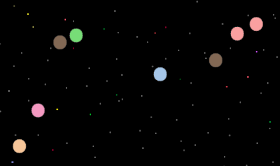](https://schau.dk/games/kaederxn/)&nbsp;&nbsp;&nbsp;[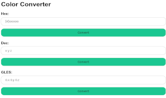](https://schau.dk/tools/colconv/)

[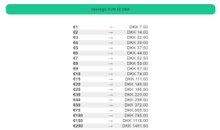](https://schau.dk/tools/e2d/)&nbsp;&nbsp;&nbsp;[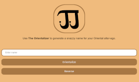](https://schau.dk/fun/orientalizer/)

[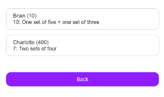](https://schau.dk/games/pxsc/)&nbsp;&nbsp;&nbsp;[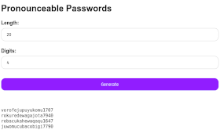](https://schau.dk/tools/procpwds/)

[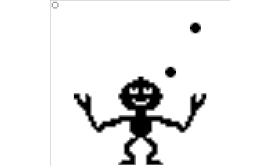](https://schau.dk/games/juggle/)&nbsp;&nbsp;&nbsp;[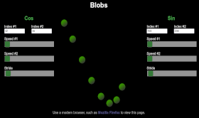](https://schau.dk/demos/blobs/)

[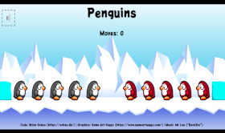](https://schau.dk/games/penguins/)&nbsp;&nbsp;&nbsp;[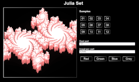](https://schau.dk/demos/julia/)

&nbsp;&nbsp;&nbsp;

[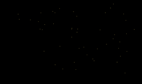](https://schau.dk/demos/explosions/)&nbsp;&nbsp;&nbsp;[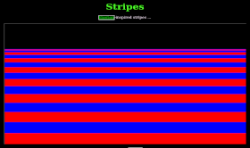](https://schau.dk/demos/stripes/)

[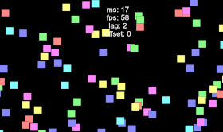](https://schau.dk/demos/rect/)

